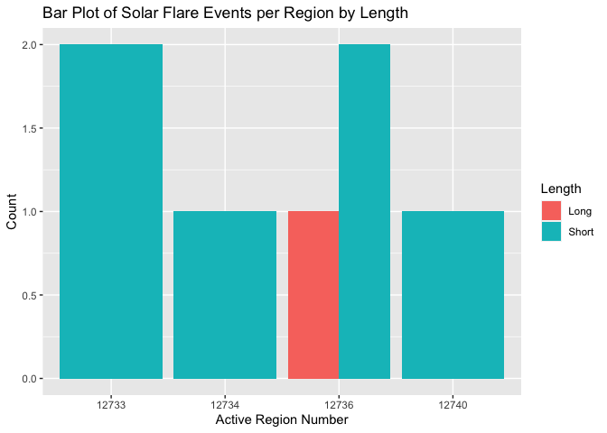
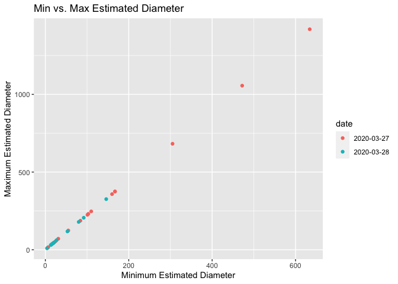
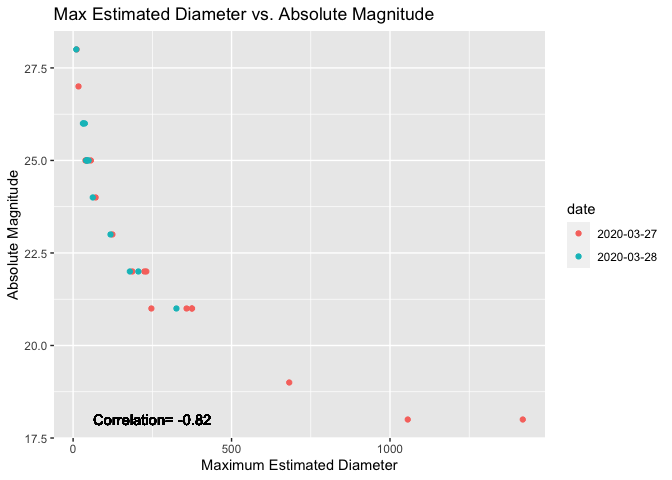
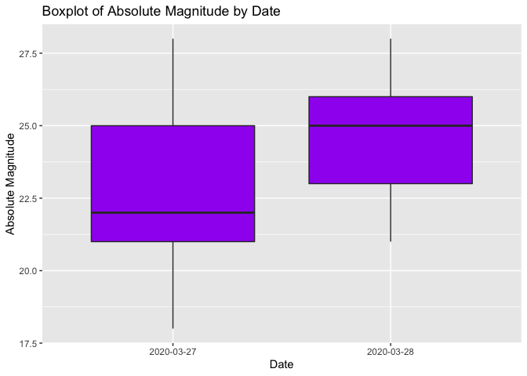

ST558 Project 1
================
Jenna Wilkie
10/2/2021

## Requirements

I used the following packages to interact with the NASA API.

*tidyverse*: A package useful for data manipulation. Installation of the
*tidyverse* package also includes the *readr*, *tidyr*, *dplyr*, and
*tibble* pakages.  
*jsonlite*: A library containing the function used to connect to the API
through URL.  
*magick*: A library used to save image from API URL.  
*Rcurl*: A library used to read in URL into JSON format *chron*: A
library that allows for date conversions included hours and minutes.

# Functions

## *DateConv* Helper Function

This function was created to convert multiple date formats into the
standard format used for the API endpoint URL’s. This will allow the
user to enter the date in a variety of formats.

``` r
dateconv<-function(date){
 date<-as.Date(date, tryFormats=c("%m-%d-%y","%m-%d-%Y","%m/%d/%y", "%m/%d/%Y",   "%B %d %Y", "%Y-%m-%d",        "%Y/%m/%d", "%B %d, %Y","%b %d, %Y", "%b %d %Y", "%B %d %y", "%B %d, %y", "%b %d %y", "%b %d, %y" ),            optional=TRUE)
 return(date)
}
```

## *Imagery* Function

This function is used to provide the URL to access the Landsat 8 image
for a specific location and date.

``` r
Imagery<-function(latitude, longitude, date, api_key){
 #convert date to account for multiple formats
 date<-dateconv(date)
 
 #get the data from the API
 outputAPI<-paste0("https://api.nasa.gov/planetary/earth/imagery?lon=",longitude, "&lat=", latitude, "&date=",   date,"&dim=0.15","&api_key=",api_key)
 
#Return webpage with image
outputAPI
}
```

## *Assets* Function

This function is used to access the date times and asset names for the
closest available imagery.

``` r
Assets<-function(latitude, longitude, date, api_key){
 #convert date to account for multiple formats
 date<-dateconv(date)
 
 #get the data from the API
 outputAPI<-fromJSON(getURL(paste0("https://api.nasa.gov/planetary/earth/assets?lon=",longitude, "&lat=",        latitude,"&date=",date,"&dim=0.15","&api_key=",api_key)))
 
 #convert to tibble
 as.tibble(outputAPI)
}
```

## *Neo-Feed* Function

This function was created to gather a list of asteroids between two
dates up to seven days apart and lists them based on their closest
approach to earth. Each Date will be returned as a data frame of
asteroids.

``` r
NeoFeed<-function(start_date, end_date, api_key){
 #convert the start and end dates to the appropriate format
 start_date<-dateconv(start_date)
 end_date<-dateconv(end_date)
 
 #get the data from the API
 outputAPI<-fromJSON(getURL(paste0("https://api.nasa.gov/neo/rest/v1/feed?start_date=",start_date,"&end_date=",  end_date,"&api_key=",api_key)))
 
 #return data frames
 outputAPI
}
```

## *Neo-Lookup* Function

This function was created to allow the user to look up an asteroid based
on its NASA ID.

``` r
NeoLookup<-function(asteroid_id, api_key){
 #get the API
 outputAPI<-fromJSON(getURL(paste0("https://api.nasa.gov/neo/rest/v1/neo/",asteroid_id,"?api_key=",api_key)))
 
 #convert object to tibble
 as.tibble(outputAPI)
}
```

## *Weather* Function

This function allows the user to look up certain space weather events
based on date and type of event.

``` r
Weather<-function(start_date,end_date,event,api_key){
#convert the start and end dates to the appropriate format 
 start_date<-dateconv(start_date)
 end_date<-dateconv(end_date)

 #allow for multiple event entries to make the function more user friendly.  Must convert event entry to all lower case letters first to account for differences in capitalization.  
event<-tolower(event)

if (event=="coronal mass ejection"||event=="cme"||event=="coronal mass ejection (cme)"){
event<-"CME"
}
else if (event=="geomagnetic storm"||event=="gst"||event=="geo storm"||event=="geomagnetic storm (gst)"){
event<-"GST"
}
else if (event=="solar flare"||event=="flr"||event=="flare"||event=="solar flare (flr)"){
event<-"FLR"
}
else if (event=="solar energetic particle"||event=="sep"||event=="solar energetic particle (sep)"){
event<-"SEP"
}
else if (event=="magnetopause crossing"||event=="mpc"||event=="magnetopause crossing (mpc)"){
  event<-"MPC"
}
else if (event=="radiation belt enhancement"||event=="rbe"||"radiation belt enhancement (rbe)"){
  event<-"RBE"
}
else if (event=="hight speed stream"||event=="hss"||event=="hight speed stream (hss)"){
  event<-"HSS"
}
else {stop("Error: Invalid weather event entry!")}

#get API data
outputAPI<-fromJSON(getURL(paste0("https://api.nasa.gov/DONKI/",event,"?startDate=",start_date,"&endDate=",end_date,"&api_key=",api_key)))

#convert object to tibble
as.tibble(outputAPI)
}
```

## Techport Function

This function allows the user to make queries about NASA’s technology
development programs.

``` r
Techport<-function(parameter_id, api_key){
 #get API data
 outputAPI<-fromJSON(getURL(paste0("https://api.nasa.gov/techport/api/projects/",id_parameter,"?api_key=",api_key)))
 
#output object as tibble
 as.tibble(outputAPI)
}
```

## NASAAPI Wrapper Function

This function combines the API searching functions above into one, to
allow the user to input the function and arguments at once.

``` r
NASAAPI<-function(func, ...){
if (func == "Imagery"){
    output <- Imagery(...)
}
else if (func == "Assets"){
    output <- Assets(...)
}
else if (func == "NeoFeed"){
    output <- NeoFeed(...)
}
else if (func == "Neo-Lookup"){
    output <- NeoLookup(...)
}
else if (func == "Weather"){
    output <- Weather(...)
}
else if (func == "Techport"){
    output <- Techport(...)
}
else {stop("Error: Invalid function entry!")}
}
```

# Exploratory Data Analysis

# EDA: Weather Function

Now that the functions are ready, I can do some data exploration.

I am going to start with the Weather function, and pull data from solar
flares that occured in
2019.

``` r
#use the NASAAPI function to pull solar flare events in 2019 and save the output as an object.
SF<-NASAAPI("Weather", "Jan 1 2019", "Dec 31 2019", "solar flare","zMTdCaPaYeIjYgd9N91EsaFUvxYsCMR1o32ih13X")
```

For the purposes of this analysis, I want to modify the character string
containing the start times and peak times. First I will remove the “T”
and “Z” so only the date and time are returned, then I will convert
those into chron values that can be used in
calculations.

``` r
#remove the additional information from the start times for CME's and Solar Flares and convert the string into date format including hours and minutes
 a<-substr(SF$peakTime, 1, 10) #substring containing the date only of peak
 b<-substr(SF$peakTime, 12, 16) #substring containing the hours and minutes of peak
 c<-paste(a,b) #combine substrings into one character string 
 d<-substr(SF$beginTime, 1, 10) #substring containing the date only of begin
 e<-substr(SF$beginTime, 12, 16) #substring containing the hours and minutes of begin
 f<-paste(d,e) #combine substrings into one character string

 #convert both strings to chron format and replace existing variables
SF$beginTime<-as.chron(c, format="%Y-%m-%d  %H:%M") 
SF$peakTime<-as.chron(f, format="%Y-%m-%d  %H:%M")
```

Now that the data has been converted into a chron format, I can do
calculations with the dates. I want to start by creating a variable in
the solar flare data set that measures the time difference between the
beginning time and the peak of each solar flare event (in seconds).

``` r
SF<-SF %>% mutate(begin_peak=difftime(beginTime,peakTime,units="secs"))
```

Now that I have the difference time, I want to create a categorical
variable that separates the begin\_peak variable into groups by length
of time difference: short (\<1000 seconds), medium (1000 to 2000
seconds), and long(\>2000
seconds).

``` r
SF<-SF %>% mutate(length=if_else(begin_peak>2000, "Long", if_else(begin_peak >=1000, "Medium","Short")))
```

With this final data frame, I can create a contingency table of the
length and Active Region Number of the flare. The table shows us that
there are no medium length flares in the data set, and only 1 long
flare.

``` r
table(SF$activeRegionNum,SF$length)
```

    ##        
    ##         Long Short
    ##   12733    0     2
    ##   12734    0     1
    ##   12736    1     2
    ##   12740    0     1

I can also create a barplot of these
results.

``` r
#convert the active region number to a character variable in the ggplot statement.  
bar<-ggplot(SF, aes(x=as.character(activeRegionNum)))
bar+geom_bar(aes(fill=as.factor(length)), position="dodge")+labs(x="Active Region Number", y="Count", title="Bar Plot of Solar Flare Events per Region by Length")+scale_fill_discrete(name="Length")
```

<!-- -->

## EDA: NeoFeed Function

Next I will look at data from the Neo-Feed function. I want to return
data frames containing asteroid information for 3/27/2020 and 3/28/2020.
The function returns a list of data frames; one for each date in the
search
range.

``` r
NeoF<-NASAAPI("NeoFeed", "03/27/2020", "03/28/2020", "zMTdCaPaYeIjYgd9N91EsaFUvxYsCMR1o32ih13X")
```

I am going to combine some columns into a new data frame. I am
interested in the absolute magnitude’s relation to estimated diameter
(in meters) and whether the asteroid is potentially hazardous or not. To
explore this further, I will create a new data frame with those columns
and a new column for the date.

``` r
#create a new column "date" in each data frame 
NeoF$near_earth_objects$`2020-03-27`$date<-"2020-03-27"
NeoF$near_earth_objects$`2020-03-28`$date<-"2020-03-28"
```

``` r
#combine the desired columns from each data frame
NeoNew1<-cbind(NeoF$near_earth_objects$`2020-03-27`$absolute_magnitude_h, NeoF$near_earth_objects$`2020-03-27`$estimated_diameter$meters$estimated_diameter_min, NeoF$near_earth_objects$`2020-03-27`$estimated_diameter$meters$estimated_diameter_max, NeoF$near_earth_objects$`2020-03-27`$is_potentially_hazardous_asteroid, NeoF$near_earth_objects$`2020-03-27`$date)

NeoNew2<-cbind(NeoF$near_earth_objects$`2020-03-28`$absolute_magnitude_h, NeoF$near_earth_objects$`2020-03-28`$estimated_diameter$meters$estimated_diameter_min, NeoF$near_earth_objects$`2020-03-28`$estimated_diameter$meters$estimated_diameter_max, NeoF$near_earth_objects$`2020-03-28`$is_potentially_hazardous_asteroid,NeoF$near_earth_objects$`2020-03-28`$date)

#combine data from both dates into one final data frame and add column names 
NeoNew<-rbind(NeoNew1, NeoNew2)
colnames(NeoNew)<-c('Absmag', 'MinDia', 'MaxDia', 'potential_hazard', 'date')

#convert to tibble
NeoNew<-as.tibble(NeoNew)

#convert all columns containing numbers to integer format
NeoNew$Absmag<-as.integer(NeoNew$Absmag)
NeoNew$MinDia<-as.integer(NeoNew$MinDia)
NeoNew$MaxDia<-as.integer(NeoNew$MaxDia)
```

Now that all of the necessary data is combined, I can produce a
contingency table for date and the potential hazard of the asteroid.

``` r
con2<-table(NeoNew$potential_hazard, NeoNew$date)
con2
```

    ##        
    ##         2020-03-27 2020-03-28
    ##   FALSE         16         13
    ##   TRUE           1          0

Only 1 asteroid was potentially hazardous on March 27, 2020 and none
were potentially hazardous on March 28, 2020 (lucky for us\!).

Next I will look at how the maximum estimated diameter compares to the
minimum. Below is a scatter plot between the minimum estimated diameter
and maximum estimated diameter of each asteroid.

``` r
sp<-ggplot(NeoNew, aes(x=MinDia, y=MaxDia))
sp+geom_point(aes(col=date))+labs(title="Min vs. Max Estimated Diameter", x='Minimum Estimated Diameter', y='Maximum Estimated Diameter' )
```

<!-- -->

The correlation looks to be close to 1, so the two variables seem to
have a strong linear relationship. Date does not appear to affect the
correlation, but March 27, 2020 had larger asteroids approaching.

Now, I can graph the Absolute Magnitude against max diameter and find
the correlation.

``` r
#find the correlation of the data
correlation<-cor(NeoNew$MaxDia,NeoNew$Absmag)
sp2<-ggplot(NeoNew, aes(x=MaxDia, y=Absmag))
sp2+geom_point(aes(col=date))+labs(title="Max Estimated Diameter vs. Absolute Magnitude", x='Maximum Estimated Diameter', y='Absolute Magnitude')+geom_text(x=250, y=18,label=paste0("Correlation= ",round(correlation,2)))
```

<!-- --> The correlation is
fairly strong (-.82), but the graph looks like it has a curve,
suggesting a possible non linear relationship between the two variables.
Date once again appears to have no effect on correlation.

Next I’ll look at a boxplot of the Absolute Magnitude data. I want to
group this by date as well.

``` r
b<-ggplot(NeoNew,aes(x=date, y=Absmag))
b+geom_boxplot(fill='purple')+labs(title="Boxplot of Absolute Magnitude by Date", y="Absolute Magnitude", x="Date")
```

<!-- --> March 28, 2020 has larger
Absolute Magnitudes than March 27, 2020. While the reverse is true for
Maxiumum Estimated Diameter. This observation agrees with the negative
correlation observed in the scatter plot above.

Last, I will look at a histogram for Absolute Magnitude.

``` r
h<-ggplot(NeoNew,aes(x=Absmag))
h+geom_histogram(color='grey',fill='turquoise', binwidth=2)+labs(title='Frequency of Absolute Magnitude Count', x='Absolute Magnitude', y='Count')
```

<!-- -->

The counts for Absolute Magnitude appear to follow an approximately
normal distribution.
