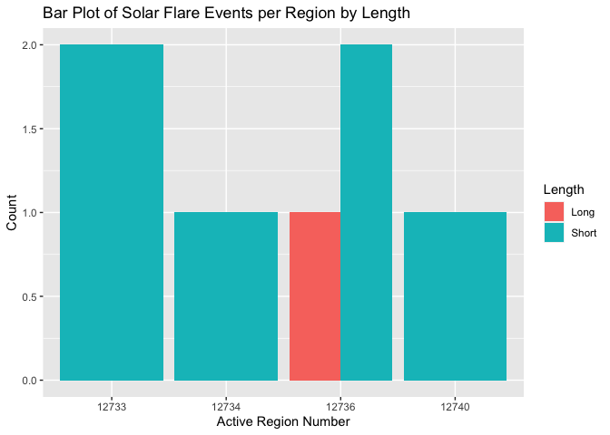
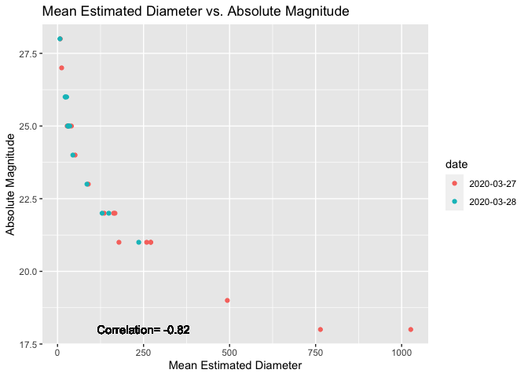
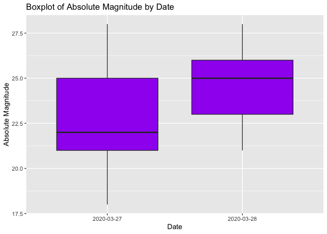
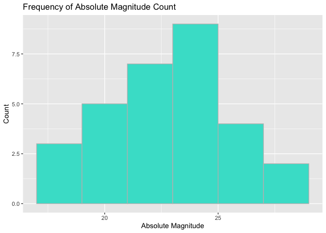

ST558 Project 1
================
Jenna Wilkie
10/2/2021

## Requirements

I used the following packages to interact with the NASA API.

*tidyverse*: A package useful for data manipulation. Installation of the
*tidyverse* package also includes the *readr*, *tidyr*, *dplyr*, and
*tibble* pakages.  
*jsonlite*: A library containing the function used to connect to the API
through URL.  
*magick*: A library used to save image from API URL.  
*chron*: A library that allows for date conversions included hours and
minutes. *RCurl*: A library that contains the getURL function that will
be used to obtain the API URL.

# Functions

## *Date\_Conv* Helper Function

This function was created to convert multiple date formats into the
standard format used for the API endpoint URL’s. This will allow the
user to enter the date in a variety of formats.

``` r
Date_Conv<-function(date){
 date<-as.Date(date, tryFormats=c("%m-%d-%y","%m-%d-%Y","%m/%d/%y", "%m/%d/%Y",   "%B %d %Y", "%Y-%m-%d", "%Y/%m/%d", "%B %d, %Y","%b %d, %Y", "%b %d %Y", "%B %d %y", "%B %d, %y", "%b %d %y", "%b %d, %y" ),            optional=TRUE)
 return(date)
}
```

## *Imagery* Function

This function is used to provide the URL to access the Landsat 8 image
for a specific location and date.

``` r
Imagery<-function(latitude, longitude, date, api_key){
 #convert date to account for multiple formats
 date<-Date_Conv(date)
 
 #get the data from the API
 output_api<-paste0("https://api.nasa.gov/planetary/earth/imagery?lon=",longitude, "&lat=", latitude, "&date=",  date,"&dim=0.15","&api_key=",api_key)
 
 #Return webpage with image
 print(image_read(output_api))
}
```

## *Assets* Function

This function is used to access the date times and asset names for the
closest available imagery.

``` r
Assets<-function(latitude, longitude, date, api_key){
 #convert date to account for multiple formats
 date<-Date_Conv(date)
 
 #get the data from the API
 output_api<-fromJSON(getURL(paste0("https://api.nasa.gov/planetary/earth/assets?lon=",longitude, "&lat=",latitude,"&date=",date,"&dim=0.15","&api_key=",api_key)))
 
output_api
}
```

## *Neo\_Feed* Function

This function was created to gather a list of asteroids between two
dates up to seven days apart and lists them based on their closest
approach to earth. Each Date will be returned as a data frame of
asteroids.

``` r
Neo_Feed<-function(start_date, end_date, api_key){
 #convert the start and end dates to the appropriate format
 start_date<-Date_Conv(start_date)
 end_date<-Date_Conv(end_date)
 
 #get the data from the API
 output_api<-fromJSON(getURL(paste0("https://api.nasa.gov/neo/rest/v1/feed?start_date=",start_date,"&end_date=",end_date,"&api_key=",api_key)))
 
 #return data frames
 output_api
}
```

## *Neo-Lookup* Function

This function was created to allow the user to look up an asteroid based
on its NASA ID.

``` r
Neo_Lookup<-function(asteroid_id, api_key){
 #get the API
 output_api<-fromJSON(getURL(paste0("https://api.nasa.gov/neo/rest/v1/neo/",asteroid_id,"?api_key=",api_key)))
 
output_api
}
```

## *Weather* Function

This function allows the user to look up certain space weather events
based on date and type of event.

``` r
Weather<-function(start_date,end_date,event,api_key){
#convert the start and end dates to the appropriate format 
 start_date<-Date_Conv(start_date)
 end_date<-Date_Conv(end_date)

 #allow for multiple event entries to make the function more user friendly.  Must convert event entry to all lower case letters first to account for differences in capitalization.  
event<-tolower(event)

if (event=="coronal mass ejection"||event=="cme"||event=="coronal mass ejection (cme)"){
event<-"CME"
}
else if (event=="geomagnetic storm"||event=="gst"||event=="geo storm"||event=="geomagnetic storm (gst)"){
event<-"GST"
}
else if (event=="solar flare"||event=="flr"||event=="flare"||event=="solar flare (flr)"){
event<-"FLR"
}
else if (event=="solar energetic particle"||event=="sep"||event=="solar energetic particle (sep)"){
event<-"SEP"
}
else if (event=="magnetopause crossing"||event=="mpc"||event=="magnetopause crossing (mpc)"){
  event<-"MPC"
}
else if (event=="radiation belt enhancement"||event=="rbe"||"radiation belt enhancement (rbe)"){
  event<-"RBE"
}
else if (event=="hight speed stream"||event=="hss"||event=="hight speed stream (hss)"){
  event<-"HSS"
}
else {stop("Error: Invalid weather event entry!")}

#get API data
output_api<-fromJSON(getURL(paste0("https://api.nasa.gov/DONKI/",event,"?startDate=",start_date,"&endDate=",end_date,"&api_key=",api_key)))


output_api
}
```

## Techport Function

This function allows the user to make queries about NASA’s technology
development programs.

``` r
Techport<-function(parameter_id, api_key){
 #get API data
 output_api<-fromJSON(getURL(paste0("https://api.nasa.gov/techport/api/projects/",id_parameter,"?api_key=",api_key)))

output_api
}
```

## NASAAPI Wrapper Function

This function combines the API searching functions above into one, to
allow the user to input the function and arguments at once.

``` r
NASAAPI<-function(func, ...){
if (func == "Imagery"){
    output <- Imagery(...)
}
else if (func == "Assets"){
    output <- Assets(...)
}
else if (func == "Neo_Feed"){
    output <- Neo_Feed(...)
}
else if (func == "Neo_Lookup"){
    output <- Neo_Lookup(...)
}
else if (func == "Weather"){
    output <- Weather(...)
}
else if (func == "Techport"){
    output <- Techport(...)
}
else {stop("Error: Invalid function entry!")}
}
```

# Exploratory Data Analysis

# EDA: Weather Function

Now that the functions are ready, I can do some data exploration. I am
going to start with the Weather function, and pull data from solar
flares that occured in
2019.

``` r
#use the NASAAPI function to pull solar flare events in 2019 and save the output as an object.
solar_flare<-NASAAPI("Weather", "Jan 1 2019", "Dec 31 2019", "solar flare","zMTdCaPaYeIjYgd9N91EsaFUvxYsCMR1o32ih13X")
solar_flare
```

    ##                         flrID             instruments         beginTime          peakTime endTime classType
    ## 1 2019-01-26T13:13:00-FLR-001 GOES15: SEM/XRS 1.0-8.0 2019-01-26T13:13Z 2019-01-26T13:22Z      NA      C5.0
    ## 2 2019-01-30T05:57:00-FLR-001 GOES15: SEM/XRS 1.0-8.0 2019-01-30T05:57Z 2019-01-30T06:11Z      NA      C5.2
    ## 3 2019-03-08T03:07:00-FLR-001 GOES15: SEM/XRS 1.0-8.0 2019-03-08T03:07Z 2019-03-08T03:18Z      NA      C1.3
    ## 4 2019-03-20T07:05:00-FLR-001 GOES15: SEM/XRS 1.0-8.0 2019-03-20T07:05Z 2019-03-20T07:14Z      NA      B6.1
    ## 5 2019-03-20T10:35:00-FLR-001 GOES15: SEM/XRS 1.0-8.0 2019-03-20T10:35Z 2019-03-20T11:18Z      NA      C4.8
    ## 6 2019-03-21T03:08:00-FLR-001 GOES15: SEM/XRS 1.0-8.0 2019-03-21T03:08Z 2019-03-21T03:12Z      NA      C5.6
    ## 7 2019-05-06T05:04:00-FLR-001 GOES15: SEM/XRS 1.0-8.0 2019-05-06T05:04Z 2019-05-06T05:10Z      NA      C9.9
    ##   sourceLocation activeRegionNum                linkedEvents
    ## 1         N05W26           12733                        NULL
    ## 2         N05W79           12733                        NULL
    ## 3         N09W04           12734 2019-03-08T04:17:00-CME-001
    ## 4         N09W23           12736 2019-03-20T08:24:00-CME-001
    ## 5         N08W26           12736 2019-03-20T08:24:00-CME-001
    ## 6         N08W34           12736                        NULL
    ## 7         N08E50           12740                        NULL
    ##                                                       link
    ## 1 https://kauai.ccmc.gsfc.nasa.gov/DONKI/view/FLR/14440/-1
    ## 2 https://kauai.ccmc.gsfc.nasa.gov/DONKI/view/FLR/14462/-1
    ## 3 https://kauai.ccmc.gsfc.nasa.gov/DONKI/view/FLR/14548/-1
    ## 4 https://kauai.ccmc.gsfc.nasa.gov/DONKI/view/FLR/14570/-1
    ## 5 https://kauai.ccmc.gsfc.nasa.gov/DONKI/view/FLR/14571/-1
    ## 6 https://kauai.ccmc.gsfc.nasa.gov/DONKI/view/FLR/14577/-1
    ## 7 https://kauai.ccmc.gsfc.nasa.gov/DONKI/view/FLR/14704/-1

For the purposes of this analysis, I want to modify the character string
containing the start times and peak times. First I will remove the “T”
and “Z” so only the date and time are returned, then I will convert
those into chron values that can be used in
calculations.

``` r
#remove the additional information from the start times for CME's and Solar Flares and convert the string into date format including hours and minutes
 a<-substr(solar_flare$peakTime, 1, 10) #substring containing the date only of peak
 b<-substr(solar_flare$peakTime, 12, 16) #substring containing the hours and minutes of peak
 c<-paste(a,b) #combine substrings into one character string 
 d<-substr(solar_flare$beginTime, 1, 10) #substring containing the date only of begin
 e<-substr(solar_flare$beginTime, 12, 16) #substring containing the hours and minutes of begin
 f<-paste(d,e) #combine substrings into one character string

 #convert both strings to chron format and replace existing variables
solar_flare$beginTime<-as.chron(c, format="%Y-%m-%d  %H:%M") 
solar_flare$peakTime<-as.chron(f, format="%Y-%m-%d  %H:%M")
```

Now that the data has been converted into a chron format, I can do
calculations with the dates. I want to start by creating a variable in
the solar flare data set that measures the time difference between the
beginning time and the peak of each solar flare event (in
seconds).

``` r
solar_flare<-solar_flare %>% mutate(beginPeak=difftime(beginTime,peakTime,units="secs"))
```

Now that I have the difference time, I want to create a categorical
variable that separates the begin\_peak variable into groups by length
of time difference: short (\<1000 seconds), medium (1000 to 2000
seconds), and long(\>2000
seconds).

``` r
solar_flare<-solar_flare %>% mutate(length=if_else(beginPeak>2000, "Long", if_else(beginPeak >=1000, "Medium","Short")))
```

With this final data frame, I can create a contingency table of the
length and Active Region Number of the flare. The table shows us that
there are no medium length flares in the data set, and only 1 long
flare.

``` r
table(solar_flare$activeRegionNum,solar_flare$length)
```

    ##        
    ##         Long Short
    ##   12733    0     2
    ##   12734    0     1
    ##   12736    1     2
    ##   12740    0     1

I can also create a barplot of these
results.

``` r
#convert the active region number to a character variable in the ggplot statement.  
bar_plot<-ggplot(solar_flare, aes(x=as.character(activeRegionNum)))
bar_plot+geom_bar(aes(fill=as.factor(length)), position="dodge")+labs(x="Active Region Number", y="Count", title="Bar Plot of Solar Flare Events per Region by Length")+scale_fill_discrete(name="Length")
```

<!-- -->

## EDA: Neo\_Feed Function

Next I will look at data from the NeoFeed function. I want to return
data frames containing asteroid information for 3/27/2020 and 3/28/2020.
The function returns a list of data frames; one for each date in the
search
range.

``` r
neo_f<-NASAAPI("Neo_Feed", "03/27/2020", "03/28/2020", "zMTdCaPaYeIjYgd9N91EsaFUvxYsCMR1o32ih13X")
neo_f
```

    ## $links
    ## $links$`next`
    ## [1] "http://www.neowsapp.com/rest/v1/feed?start_date=2020-03-28&end_date=2020-03-29&detailed=false&api_key=zMTdCaPaYeIjYgd9N91EsaFUvxYsCMR1o32ih13X"
    ## 
    ## $links$prev
    ## [1] "http://www.neowsapp.com/rest/v1/feed?start_date=2020-03-26&end_date=2020-03-27&detailed=false&api_key=zMTdCaPaYeIjYgd9N91EsaFUvxYsCMR1o32ih13X"
    ## 
    ## $links$self
    ## [1] "http://www.neowsapp.com/rest/v1/feed?start_date=2020-03-27&end_date=2020-03-28&detailed=false&api_key=zMTdCaPaYeIjYgd9N91EsaFUvxYsCMR1o32ih13X"
    ## 
    ## 
    ## $element_count
    ## [1] 30
    ## 
    ## $near_earth_objects
    ## $near_earth_objects$`2020-03-28`
    ##                                                                                             self       id
    ## 1   http://www.neowsapp.com/rest/v1/neo/3789634?api_key=zMTdCaPaYeIjYgd9N91EsaFUvxYsCMR1o32ih13X  3789634
    ## 2   http://www.neowsapp.com/rest/v1/neo/3838870?api_key=zMTdCaPaYeIjYgd9N91EsaFUvxYsCMR1o32ih13X  3838870
    ## 3   http://www.neowsapp.com/rest/v1/neo/3841195?api_key=zMTdCaPaYeIjYgd9N91EsaFUvxYsCMR1o32ih13X  3841195
    ## 4   http://www.neowsapp.com/rest/v1/neo/3879296?api_key=zMTdCaPaYeIjYgd9N91EsaFUvxYsCMR1o32ih13X  3879296
    ## 5   http://www.neowsapp.com/rest/v1/neo/3879301?api_key=zMTdCaPaYeIjYgd9N91EsaFUvxYsCMR1o32ih13X  3879301
    ## 6  http://www.neowsapp.com/rest/v1/neo/54006055?api_key=zMTdCaPaYeIjYgd9N91EsaFUvxYsCMR1o32ih13X 54006055
    ## 7  http://www.neowsapp.com/rest/v1/neo/54016250?api_key=zMTdCaPaYeIjYgd9N91EsaFUvxYsCMR1o32ih13X 54016250
    ## 8  http://www.neowsapp.com/rest/v1/neo/54016396?api_key=zMTdCaPaYeIjYgd9N91EsaFUvxYsCMR1o32ih13X 54016396
    ## 9  http://www.neowsapp.com/rest/v1/neo/54016453?api_key=zMTdCaPaYeIjYgd9N91EsaFUvxYsCMR1o32ih13X 54016453
    ## 10 http://www.neowsapp.com/rest/v1/neo/54016455?api_key=zMTdCaPaYeIjYgd9N91EsaFUvxYsCMR1o32ih13X 54016455
    ## 11 http://www.neowsapp.com/rest/v1/neo/54016564?api_key=zMTdCaPaYeIjYgd9N91EsaFUvxYsCMR1o32ih13X 54016564
    ## 12 http://www.neowsapp.com/rest/v1/neo/54053711?api_key=zMTdCaPaYeIjYgd9N91EsaFUvxYsCMR1o32ih13X 54053711
    ## 13 http://www.neowsapp.com/rest/v1/neo/54054355?api_key=zMTdCaPaYeIjYgd9N91EsaFUvxYsCMR1o32ih13X 54054355
    ##    neo_reference_id        name                                   nasa_jpl_url absolute_magnitude_h
    ## 1           3789634 (2017 WZ13)  http://ssd.jpl.nasa.gov/sbdb.cgi?sstr=3789634                 26.4
    ## 2           3838870  (2019 DY1)  http://ssd.jpl.nasa.gov/sbdb.cgi?sstr=3838870                 25.4
    ## 3           3841195 (2019 GD20)  http://ssd.jpl.nasa.gov/sbdb.cgi?sstr=3841195                 21.3
    ## 4           3879296  (2019 UO2)  http://ssd.jpl.nasa.gov/sbdb.cgi?sstr=3879296                 25.8
    ## 5           3879301  (2019 UW2)  http://ssd.jpl.nasa.gov/sbdb.cgi?sstr=3879301                 22.3
    ## 6          54006055  (2020 DU4) http://ssd.jpl.nasa.gov/sbdb.cgi?sstr=54006055                 23.5
    ## 7          54016250  (2020 FE2) http://ssd.jpl.nasa.gov/sbdb.cgi?sstr=54016250                 26.0
    ## 8          54016396  (2020 FW5) http://ssd.jpl.nasa.gov/sbdb.cgi?sstr=54016396                 25.6
    ## 9          54016453   (2020 GT) http://ssd.jpl.nasa.gov/sbdb.cgi?sstr=54016453                 25.7
    ## 10         54016455   (2020 GV) http://ssd.jpl.nasa.gov/sbdb.cgi?sstr=54016455                 26.3
    ## 11         54016564   (2020 HU) http://ssd.jpl.nasa.gov/sbdb.cgi?sstr=54016564                 24.9
    ## 12         54053711  (2020 QX6) http://ssd.jpl.nasa.gov/sbdb.cgi?sstr=54053711                 28.8
    ## 13         54054355  (2020 RJ7) http://ssd.jpl.nasa.gov/sbdb.cgi?sstr=54054355                 22.6
    ##    estimated_diameter.kilometers.estimated_diameter_min estimated_diameter.kilometers.estimated_diameter_max
    ## 1                                           0.013949382                                           0.03119177
    ## 2                                           0.022108281                                           0.04943562
    ## 3                                           0.146067964                                           0.32661790
    ## 4                                           0.018388867                                           0.04111876
    ## 5                                           0.092162655                                           0.20608196
    ## 6                                           0.053034072                                           0.11858779
    ## 7                                           0.016770846                                           0.03750075
    ## 8                                           0.020162992                                           0.04508582
    ## 9                                           0.019255508                                           0.04305662
    ## 10                                          0.014606796                                           0.03266179
    ## 11                                          0.027832677                                           0.06223576
    ## 12                                          0.004619075                                           0.01032856
    ## 13                                          0.080270317                                           0.17948988
    ##    estimated_diameter.meters.estimated_diameter_min estimated_diameter.meters.estimated_diameter_max
    ## 1                                         13.949382                                         31.19177
    ## 2                                         22.108281                                         49.43562
    ## 3                                        146.067964                                        326.61790
    ## 4                                         18.388867                                         41.11876
    ## 5                                         92.162655                                        206.08196
    ## 6                                         53.034072                                        118.58779
    ## 7                                         16.770846                                         37.50075
    ## 8                                         20.162992                                         45.08582
    ## 9                                         19.255508                                         43.05662
    ## 10                                        14.606796                                         32.66179
    ## 11                                        27.832677                                         62.23576
    ## 12                                         4.619075                                         10.32856
    ## 13                                        80.270317                                        179.48988
    ##    estimated_diameter.miles.estimated_diameter_min estimated_diameter.miles.estimated_diameter_max
    ## 1                                      0.008667742                                     0.019381659
    ## 2                                      0.013737445                                     0.030717860
    ## 3                                      0.090762397                                     0.202950890
    ## 4                                      0.011426309                                     0.025550003
    ## 5                                      0.057267201                                     0.128053354
    ## 6                                      0.032953835                                     0.073687014
    ## 7                                      0.010420917                                     0.023301880
    ## 8                                      0.012528698                                     0.028015021
    ## 9                                      0.011964814                                     0.026754138
    ## 10                                     0.009076240                                     0.020295089
    ## 11                                     0.017294418                                     0.038671495
    ## 12                                     0.002870159                                     0.006417871
    ## 13                                     0.049877647                                     0.111529809
    ##    estimated_diameter.feet.estimated_diameter_min estimated_diameter.feet.estimated_diameter_max
    ## 1                                        45.76569                                      102.33520
    ## 2                                        72.53373                                      162.19036
    ## 3                                       479.22562                                     1071.58106
    ## 4                                        60.33093                                      134.90406
    ## 5                                       302.37092                                      676.12194
    ## 6                                       173.99631                                      389.06757
    ## 7                                        55.02246                                      123.03397
    ## 8                                        66.15155                                      147.91936
    ## 9                                        63.17424                                      141.26190
    ## 10                                       47.92256                                      107.15811
    ## 11                                       91.31456                                      204.18556
    ## 12                                       15.15444                                       33.88637
    ## 13                                      263.35407                                      588.87759
    ##    is_potentially_hazardous_asteroid
    ## 1                              FALSE
    ## 2                              FALSE
    ## 3                              FALSE
    ## 4                              FALSE
    ## 5                              FALSE
    ## 6                              FALSE
    ## 7                              FALSE
    ## 8                              FALSE
    ## 9                              FALSE
    ## 10                             FALSE
    ## 11                             FALSE
    ## 12                             FALSE
    ## 13                             FALSE
    ##                                                                                                                                                              close_approach_data
    ## 1  2020-03-28, 2020-Mar-28 17:01, 1585414860000, 18.5539250562, 66794.1302022692, 41503.2749581822, 0.3094166993, 120.3630960277, 46288079.157710491, 28762078.6732911358, Earth
    ## 2   2020-03-28, 2020-Mar-28 18:47, 1585421220000, 11.0697362155, 39851.0503756312, 24761.892940347, 0.3664368939, 142.5439517271, 54818178.816855993, 34062436.8206109834, Earth
    ## 3  2020-03-28, 2020-Mar-28 23:26, 1585437960000, 15.4712823524, 55696.6164688128, 34607.7114941909, 0.4274321261, 166.2710970529, 63942935.634131407, 39732297.7919191366, Earth
    ## 4  2020-03-28, 2020-Mar-28 05:18, 1585372680000, 17.1057109244, 61580.5593276859, 38263.7647666946, 0.3347672936, 130.2244772104, 50080474.068224632, 31118563.5990266416, Earth
    ## 5  2020-03-28, 2020-Mar-28 19:16, 1585422960000, 19.9861357613, 71950.0887406001, 44706.9870844023, 0.3866083409, 150.3906446101, 57835784.322873883, 35937489.9346822654, Earth
    ## 6    2020-03-28, 2020-Mar-28 02:08, 1585361280000, 11.1091901159, 39993.0844173872, 24850.1473703482, 0.1228064925, 47.7717255825, 18371589.700170975, 11415576.492370455, Earth
    ## 7        2020-03-28, 2020-Mar-28 13:14, 1585401240000, 7.0687502376, 25447.500855536, 15812.0874065968, 0.0116028778, 4.5135194642, 1735765.804750286, 1078554.8578185068, Earth
    ## 8          2020-03-28, 2020-Mar-28 06:15, 1585376100000, 13.5682172965, 48845.5822672589, 30350.7452704532, 0.023875318, 9.287498702, 3571696.71837266, 2219349.428196308, Earth
    ## 9     2020-03-28, 2020-Mar-28 15:35, 1585409700000, 11.4408094935, 41186.9141766569, 25591.9467560455, 0.0294668526, 11.4626056614, 4408178.384563962, 2739115.0337161956, Earth
    ## 10       2020-03-28, 2020-Mar-28 21:45, 1585431900000, 7.076831715, 25476.594173851, 15830.1648631909, 0.0494306499, 19.2285228111, 7394719.937755713, 4594865.9025583194, Earth
    ## 11    2020-03-28, 2020-Mar-28 17:54, 1585418040000, 8.4029028741, 30250.4503466816, 18796.4534390256, 0.0728985622, 28.3575406958, 10905469.631182514, 6776344.6055421332, Earth
    ## 12 2020-03-28, 2020-Mar-28 04:52, 1585371120000, 12.4668070761, 44880.5054741303, 27887.0007486339, 0.3728849112, 145.0522304568, 55782788.470659144, 34661817.4658344272, Earth
    ## 13 2020-03-28, 2020-Mar-28 12:02, 1585396920000, 17.1675327788, 61803.1180035709, 38402.0540728299, 0.4521930487, 175.9030959443, 67647116.914326269, 42033969.3095057522, Earth
    ##    is_sentry_object
    ## 1             FALSE
    ## 2             FALSE
    ## 3             FALSE
    ## 4             FALSE
    ## 5             FALSE
    ## 6             FALSE
    ## 7             FALSE
    ## 8             FALSE
    ## 9             FALSE
    ## 10            FALSE
    ## 11            FALSE
    ## 12            FALSE
    ## 13            FALSE
    ## 
    ## $near_earth_objects$`2020-03-27`
    ##                                                                                             self       id
    ## 1   http://www.neowsapp.com/rest/v1/neo/2085953?api_key=zMTdCaPaYeIjYgd9N91EsaFUvxYsCMR1o32ih13X  2085953
    ## 2   http://www.neowsapp.com/rest/v1/neo/2304293?api_key=zMTdCaPaYeIjYgd9N91EsaFUvxYsCMR1o32ih13X  2304293
    ## 3   http://www.neowsapp.com/rest/v1/neo/3620863?api_key=zMTdCaPaYeIjYgd9N91EsaFUvxYsCMR1o32ih13X  3620863
    ## 4   http://www.neowsapp.com/rest/v1/neo/3634387?api_key=zMTdCaPaYeIjYgd9N91EsaFUvxYsCMR1o32ih13X  3634387
    ## 5   http://www.neowsapp.com/rest/v1/neo/3801990?api_key=zMTdCaPaYeIjYgd9N91EsaFUvxYsCMR1o32ih13X  3801990
    ## 6  http://www.neowsapp.com/rest/v1/neo/54013534?api_key=zMTdCaPaYeIjYgd9N91EsaFUvxYsCMR1o32ih13X 54013534
    ## 7   http://www.neowsapp.com/rest/v1/neo/3893632?api_key=zMTdCaPaYeIjYgd9N91EsaFUvxYsCMR1o32ih13X  3893632
    ## 8  http://www.neowsapp.com/rest/v1/neo/54013542?api_key=zMTdCaPaYeIjYgd9N91EsaFUvxYsCMR1o32ih13X 54013542
    ## 9  http://www.neowsapp.com/rest/v1/neo/54016207?api_key=zMTdCaPaYeIjYgd9N91EsaFUvxYsCMR1o32ih13X 54016207
    ## 10 http://www.neowsapp.com/rest/v1/neo/54016309?api_key=zMTdCaPaYeIjYgd9N91EsaFUvxYsCMR1o32ih13X 54016309
    ## 11 http://www.neowsapp.com/rest/v1/neo/54016334?api_key=zMTdCaPaYeIjYgd9N91EsaFUvxYsCMR1o32ih13X 54016334
    ## 12 http://www.neowsapp.com/rest/v1/neo/54016375?api_key=zMTdCaPaYeIjYgd9N91EsaFUvxYsCMR1o32ih13X 54016375
    ## 13 http://www.neowsapp.com/rest/v1/neo/54016381?api_key=zMTdCaPaYeIjYgd9N91EsaFUvxYsCMR1o32ih13X 54016381
    ## 14 http://www.neowsapp.com/rest/v1/neo/54016493?api_key=zMTdCaPaYeIjYgd9N91EsaFUvxYsCMR1o32ih13X 54016493
    ## 15 http://www.neowsapp.com/rest/v1/neo/54016772?api_key=zMTdCaPaYeIjYgd9N91EsaFUvxYsCMR1o32ih13X 54016772
    ## 16 http://www.neowsapp.com/rest/v1/neo/54051343?api_key=zMTdCaPaYeIjYgd9N91EsaFUvxYsCMR1o32ih13X 54051343
    ## 17 http://www.neowsapp.com/rest/v1/neo/54132120?api_key=zMTdCaPaYeIjYgd9N91EsaFUvxYsCMR1o32ih13X 54132120
    ##    neo_reference_id               name                                   nasa_jpl_url absolute_magnitude_h
    ## 1           2085953  85953 (1999 FK21)  http://ssd.jpl.nasa.gov/sbdb.cgi?sstr=2085953                18.11
    ## 2           2304293 304293 (2006 SQ78)  http://ssd.jpl.nasa.gov/sbdb.cgi?sstr=2304293                18.75
    ## 3           3620863       (2012 XA133)  http://ssd.jpl.nasa.gov/sbdb.cgi?sstr=3620863                21.00
    ## 4           3634387        (2013 GQ38)  http://ssd.jpl.nasa.gov/sbdb.cgi?sstr=3634387                23.40
    ## 5           3801990         (2018 FC1)  http://ssd.jpl.nasa.gov/sbdb.cgi?sstr=3801990                21.90
    ## 6          54013534        (2019 NN36) http://ssd.jpl.nasa.gov/sbdb.cgi?sstr=54013534                19.70
    ## 7           3893632         (2019 WT3)  http://ssd.jpl.nasa.gov/sbdb.cgi?sstr=3893632                24.60
    ## 8          54013542          (2020 EH) http://ssd.jpl.nasa.gov/sbdb.cgi?sstr=54013542                21.00
    ## 9          54016207          (2020 FP) http://ssd.jpl.nasa.gov/sbdb.cgi?sstr=54016207                25.70
    ## 10         54016309         (2020 FZ2) http://ssd.jpl.nasa.gov/sbdb.cgi?sstr=54016309                25.10
    ## 11         54016334         (2020 FV3) http://ssd.jpl.nasa.gov/sbdb.cgi?sstr=54016334                27.70
    ## 12         54016375         (2020 FM5) http://ssd.jpl.nasa.gov/sbdb.cgi?sstr=54016375                28.60
    ## 13         54016381         (2020 FT5) http://ssd.jpl.nasa.gov/sbdb.cgi?sstr=54016381                25.90
    ## 14         54016493         (2020 GB2) http://ssd.jpl.nasa.gov/sbdb.cgi?sstr=54016493                21.10
    ## 15         54016772         (2020 HA7) http://ssd.jpl.nasa.gov/sbdb.cgi?sstr=54016772                22.50
    ## 16         54051343         (2020 QO4) http://ssd.jpl.nasa.gov/sbdb.cgi?sstr=54051343                22.05
    ## 17         54132120        (2010 PC73) http://ssd.jpl.nasa.gov/sbdb.cgi?sstr=54132120                22.10
    ##    estimated_diameter.kilometers.estimated_diameter_min estimated_diameter.kilometers.estimated_diameter_max
    ## 1                                           0.634680239                                           1.41918816
    ## 2                                           0.472666667                                           1.05691480
    ## 3                                           0.167708462                                           0.37500752
    ## 4                                           0.055533491                                           0.12417666
    ## 5                                           0.110803882                                           0.24776501
    ## 6                                           0.305179233                                           0.68240151
    ## 7                                           0.031956189                                           0.07145621
    ## 8                                           0.167708462                                           0.37500752
    ## 9                                           0.019255508                                           0.04305662
    ## 10                                          0.025383703                                           0.05675969
    ## 11                                          0.007665756                                           0.01714115
    ## 12                                          0.005064715                                           0.01132505
    ## 13                                          0.017561232                                           0.03926811
    ## 14                                          0.160160338                                           0.35812940
    ## 15                                          0.084053340                                           0.18794898
    ## 16                                          0.103408200                                           0.23122776
    ## 17                                          0.101054342                                           0.22596438
    ##    estimated_diameter.meters.estimated_diameter_min estimated_diameter.meters.estimated_diameter_max
    ## 1                                        634.680239                                       1419.18816
    ## 2                                        472.666667                                       1056.91480
    ## 3                                        167.708462                                        375.00752
    ## 4                                         55.533491                                        124.17666
    ## 5                                        110.803882                                        247.76501
    ## 6                                        305.179233                                        682.40151
    ## 7                                         31.956189                                         71.45621
    ## 8                                        167.708462                                        375.00752
    ## 9                                         19.255508                                         43.05662
    ## 10                                        25.383703                                         56.75969
    ## 11                                         7.665756                                         17.14115
    ## 12                                         5.064715                                         11.32505
    ## 13                                        17.561232                                         39.26811
    ## 14                                       160.160338                                        358.12940
    ## 15                                        84.053340                                        187.94898
    ## 16                                       103.408200                                        231.22776
    ## 17                                       101.054342                                        225.96438
    ##    estimated_diameter.miles.estimated_diameter_min estimated_diameter.miles.estimated_diameter_max
    ## 1                                      0.394371895                                     0.881842365
    ## 2                                      0.293701360                                     0.656736205
    ## 3                                      0.104209175                                     0.233018799
    ## 4                                      0.034506901                                     0.077159776
    ## 5                                      0.068850319                                     0.153953994
    ## 6                                      0.189629525                                     0.424024508
    ## 7                                      0.019856649                                     0.044400817
    ## 8                                      0.104209175                                     0.233018799
    ## 9                                      0.011964814                                     0.026754138
    ## 10                                     0.015772697                                     0.035268822
    ## 11                                     0.004763278                                     0.010651014
    ## 12                                     0.003147067                                     0.007037055
    ## 13                                     0.010912040                                     0.024400064
    ## 14                                     0.099518989                                     0.222531225
    ## 15                                     0.052228308                                     0.116786047
    ## 16                                     0.064254856                                     0.143678227
    ## 17                                     0.062792237                                     0.140407711
    ##    estimated_diameter.feet.estimated_diameter_min estimated_diameter.feet.estimated_diameter_max
    ## 1                                      2082.28432                                     4656.12928
    ## 2                                      1550.74371                                     3467.56835
    ## 3                                       550.22463                                     1230.33968
    ## 4                                       182.19650                                      407.40376
    ## 5                                       363.52981                                      812.87736
    ## 6                                      1001.24423                                     2238.85017
    ## 7                                       104.84314                                      234.43639
    ## 8                                       550.22463                                     1230.33968
    ## 9                                        63.17424                                      141.26190
    ## 10                                       83.27987                                      186.21945
    ## 11                                       25.15012                                       56.23737
    ## 12                                       16.61652                                       37.15566
    ## 13                                       57.61559                                      128.83238
    ## 14                                      525.46044                                     1174.96527
    ## 15                                      275.76556                                      616.63054
    ## 16                                      339.26576                                      758.62130
    ## 17                                      331.54313                                      741.35297
    ##    is_potentially_hazardous_asteroid
    ## 1                              FALSE
    ## 2                              FALSE
    ## 3                               TRUE
    ## 4                              FALSE
    ## 5                              FALSE
    ## 6                              FALSE
    ## 7                              FALSE
    ## 8                              FALSE
    ## 9                              FALSE
    ## 10                             FALSE
    ## 11                             FALSE
    ## 12                             FALSE
    ## 13                             FALSE
    ## 14                             FALSE
    ## 15                             FALSE
    ## 16                             FALSE
    ## 17                             FALSE
    ##                                                                                                                                                              close_approach_data
    ## 1  2020-03-27, 2020-Mar-27 22:28, 1585348080000, 32.5810814835, 117291.8933406655, 72880.6211704819, 0.3774988645, 146.8470582905, 56473026.056618615, 35090711.213682287, Earth
    ## 2    2020-03-27, 2020-Mar-27 20:16, 1585340160000, 24.74335504, 89076.0781439561, 55348.4108889487, 0.2772265776, 107.8411386864, 41472505.516349712, 25769819.9654295456, Earth
    ## 3     2020-03-27, 2020-Mar-27 03:52, 1585281120000, 23.6655944128, 85196.1398859907, 52937.5681419368, 0.0445291287, 17.3218310643, 6661462.806475869, 4139241.0487862322, Earth
    ## 4  2020-03-27, 2020-Mar-27 09:58, 1585303080000, 21.1482021854, 76133.5278673788, 47306.4134684832, 0.4680763886, 182.0817151654, 70023230.731852282, 43510417.9718822116, Earth
    ## 5        2020-03-27, 2020-Mar-27 03:59, 1585281540000, 14.3667518858, 51720.3067888156, 32136.987293306, 0.446997345, 173.881967205, 66869850.70765515, 41550998.48433507, Earth
    ## 6  2020-03-27, 2020-Mar-27 11:37, 1585309020000, 21.4747821213, 77309.2156367146, 48036.9401271574, 0.3923823546, 152.6367359394, 58699564.473744702, 36474218.0320208076, Earth
    ## 7     2020-03-27, 2020-Mar-27 22:26, 1585347960000, 4.555717553, 16400.5831909646, 10190.684594408, 0.3866412082, 150.4034299898, 57840701.200946534, 35940545.1410448092, Earth
    ## 8  2020-03-27, 2020-Mar-27 15:16, 1585322160000, 29.4845053025, 106144.2190888632, 65953.8899110772, 0.1141933749, 44.4212228361, 17083085.653151463, 10614937.2036896694, Earth
    ## 9      2020-03-27, 2020-Mar-27 00:39, 1585269540000, 9.4495583503, 34018.4100611856, 21137.7170738517, 0.0376573387, 14.6487047543, 5633457.659388569, 3500468.2706734922, Earth
    ## 10    2020-03-27, 2020-Mar-27 22:24, 1585347840000, 21.3230799366, 76763.0877718928, 47697.5975102631, 0.0357927477, 13.9233788553, 5354518.817367399, 3327143.7114081462, Earth
    ## 11             2020-03-27, 2020-Mar-27 04:07, 1585282020000, 6.5315729734, 23513.6627043708, 14610.4755842797, 0.02641829, 10.27671481, 3952119.9130423, 2455733.44009174, Earth
    ## 12      2020-03-27, 2020-Mar-27 09:17, 1585300620000, 5.4903486341, 19765.2550828005, 12281.3608596434, 0.0139202909, 5.4149931601, 2082445.868420383, 1293971.8603639654, Earth
    ## 13     2020-03-27, 2020-Mar-27 10:12, 1585303920000, 13.1706063645, 47414.1829120934, 29461.3293766838, 0.0249142068, 9.6916264452, 3727112.270019516, 2315920.1739446808, Earth
    ## 14  2020-03-27, 2020-Mar-27 22:18, 1585347480000, 34.8945018611, 125620.2067000752, 78055.5112131662, 0.1406240245, 54.7027455305, 21037054.536027815, 13071819.540361247, Earth
    ## 15     2020-03-27, 2020-Mar-27 19:47, 1585338420000, 10.8464315253, 39047.1534911491, 24262.3826789865, 0.0521771585, 20.2969146565, 7805591.774252395, 4850169.823157251, Earth
    ## 16 2020-03-27, 2020-Mar-27 11:10, 1585307400000, 14.9361012631, 53769.9645472216, 33410.5649154666, 0.3018526291, 117.4206727199, 45156510.367260017, 28058954.4312095546, Earth
    ## 17 2020-03-27, 2020-Mar-27 11:10, 1585307400000, 14.9361012855, 53769.9646278054, 33410.5649655383, 0.3018526288, 117.4206726032, 45156510.322380656, 28058954.4033228128, Earth
    ##    is_sentry_object
    ## 1             FALSE
    ## 2             FALSE
    ## 3             FALSE
    ## 4             FALSE
    ## 5             FALSE
    ## 6             FALSE
    ## 7             FALSE
    ## 8             FALSE
    ## 9             FALSE
    ## 10            FALSE
    ## 11            FALSE
    ## 12            FALSE
    ## 13            FALSE
    ## 14            FALSE
    ## 15            FALSE
    ## 16            FALSE
    ## 17            FALSE

I am going to combine some columns into a new data frame. I am
interested in the absolute magnitude’s relation to estimated diameter
(in meters) and whether the asteroid is potentially hazardous or not. To
explore this further, I will create a new data frame with those columns
and aolumn for the date.

``` r
#create a new column "date" in each data frame 
neo_f$near_earth_objects$`2020-03-27`$date<-"2020-03-27"
neo_f$near_earth_objects$`2020-03-28`$date<-"2020-03-28"
```

``` r
#combine the desired columns from each data frame
neo_new_1<-cbind(neo_f$near_earth_objects$`2020-03-27`$absolute_magnitude_h, neo_f$near_earth_objects$`2020-03-27`$estimated_diameter$meters$estimated_diameter_min, neo_f$near_earth_objects$`2020-03-27`$estimated_diameter$meters$estimated_diameter_max, neo_f$near_earth_objects$`2020-03-27`$is_potentially_hazardous_asteroid, neo_f$near_earth_objects$`2020-03-27`$date)

neo_new_2<-cbind(neo_f$near_earth_objects$`2020-03-28`$absolute_magnitude_h, neo_f$near_earth_objects$`2020-03-28`$estimated_diameter$meters$estimated_diameter_min, neo_f$near_earth_objects$`2020-03-28`$estimated_diameter$meters$estimated_diameter_max, neo_f$near_earth_objects$`2020-03-28`$is_potentially_hazardous_asteroid,neo_f$near_earth_objects$`2020-03-28`$date)

#combine data from both dates into one final data frame and add column names 
neo_new<-rbind(neo_new_1, neo_new_2)
colnames(neo_new)<-c('abs_mag', 'min_dia', 'max_dia', 'potential_hazard', 'date')

#convert to tibble
neo_new<-as_tibble(neo_new)

#convert all columns containing numbers to integer format
neo_new$abs_mag<-as.integer(neo_new$abs_mag)
neo_new$min_dia<-as.integer(neo_new$min_dia)
neo_new$max_dia<-as.integer(neo_new$max_dia)
```

Now that the necessary data is combined, I can produce a contingency
table for date and the potential hazard of the asteroid.

``` r
table(neo_new$potential_hazard, neo_new$date)
```

    ##        
    ##         2020-03-27 2020-03-28
    ##   FALSE         16         13
    ##   TRUE           1          0

Only 1 asteroid was potentially hazardous on March 27, 2020 and none
were potentially hazardous on March 28, 2020 (lucky for us\!).

Next I will look at how the maximum estimated diameter compares to the
minimum. Below is a scatter plot between the minimum estimated diameter
and maximum estimated diameter of each asteroid.

``` r
scatter_plot<-ggplot(neo_new, aes(x=min_dia, y=max_dia))
scatter_plot+geom_point(aes(col=date))+labs(title="Min vs. Max Estimated Diameter", x='Minimum Estimated Diameter', y='Maximum Estimated Diameter' )
```

<!-- -->

The correlation looks to be close to 1, so the graph shows a strong
linear relationship. Date does not appear to affect the correlation, but
March 27, 2020 had larger asteroids approaching.

I have two values for estimated diameter, max and min. I am going to add
a variable to the new data frame that is the approximate average
estimated diameter of each asteroid.

``` r
neo_new$mean_dia<-(neo_new$max_dia+neo_new$min_dia)/2
```

Now, I can graph the absolute magnitude against mean estimated diameter
and find the correlation.

``` r
#find the correlation of the data
correlation<-cor(neo_new$mean_dia,neo_new$abs_mag)
scatter_plot_2<-ggplot(neo_new, aes(x=mean_dia, y=abs_mag))
scatter_plot_2+geom_point(aes(col=date))+labs(title="Mean Estimated Diameter vs. Absolute Magnitude", x='Mean Estimated Diameter', y='Absolute Magnitude')+geom_text(x=250, y=18,label=paste0("Correlation= ",round(correlation,2)))
```

<!-- -->

The correlation is fairly strong (-.82), but the graph looks like it has
a curve, suggesting a possible non linear relationship between the two
variables. The larger asteroids on 3-27 are making the curve more
pronounced.

Next I’ll look at a boxplot of the absolute magnitude data. I want to
group this by date as well.

``` r
box_plot<-ggplot(neo_new,aes(x=date, y=abs_mag))
box_plot+geom_boxplot(fill='purple')+labs(title="Boxplot of Absolute Magnitude by Date", y="Absolute Magnitude", x="Date")
```

<!-- -->

March 28, 2020 has larger absolute magnitudes than March 27, 2020. The
scatter plot above shows that the opposite is true for minimum and
maximum estimated diameter. This observation agrees with the negative
correlation observed in the scatter plot above.

Last, I will look at a histogram for absolute magnitude.

``` r
histogram<-ggplot(neo_new,aes(x=abs_mag))
histogram+geom_histogram(color='grey',fill='turquoise', binwidth=2)+labs(title='Frequency of Absolute Magnitude Count', x='Absolute Magnitude', y='Count')
```

<!-- -->

The counts for absolute magnitude appear to follow an approximately
normal distribution, so there were not a lot of unusually large or
unusually small magnitudes observed on these two dates.
